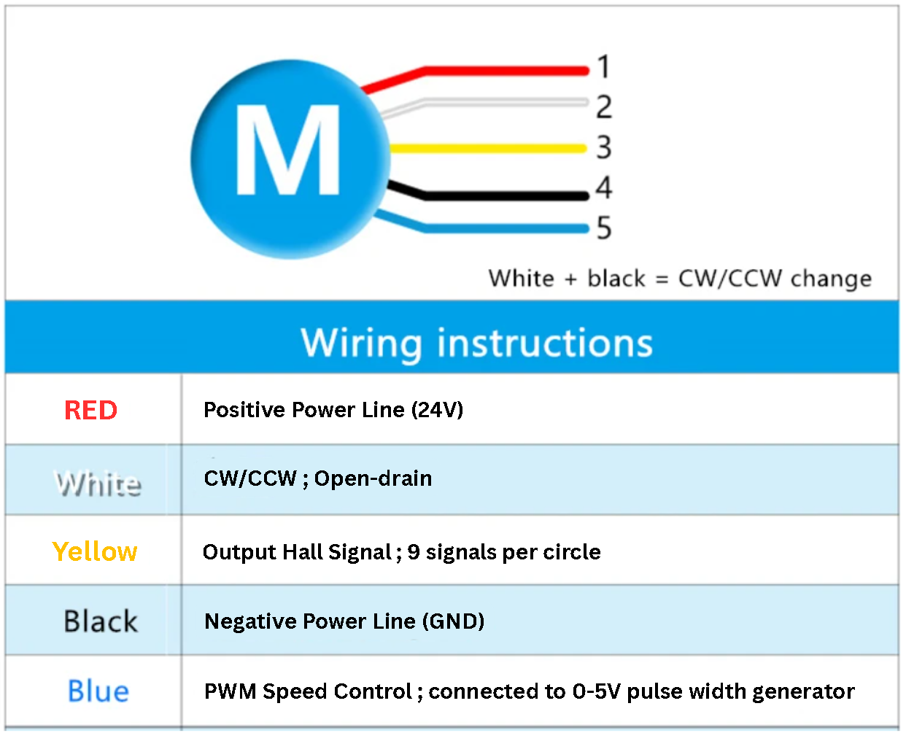

# Homework 1
Prepared by:   
Kingslie (yskong@connect.ust.hk) & Yuan (ylawaa@connect.ust.hk)

## Table of Contents

1. [Deadline](#deadline)
2. [Overview](#overview)
3. [TODO Map](#todo-map)
4. [Schematic Requirements](#schematic-requirements)
5. [Submission](#submission)
   - [Format](#format)
   - [Naming Convention](#naming-convention)
   - [Where to Submit](#where-to-submit)
6. [Additional Tasks (Optional)](#additional-tasks-optional)

---

## Deadline

| Homework | Release Date | Deadline |
|----------|--------------|----------|
| H01 | 23 Sep | 29 Sep |
| H02 | 24 Sep | 1 Oct |
| H03 | 28 Sep | 4 Oct |

## Overview
Homework 1 focuses on getting you familiar with the KiCAD interface by **completing a partially-drawn schematic**. You will wire up the given blocks, fill in component values, and resolve ERC errors.

> 📝 **Starter file:** [`HW1-Template.zip`](HW1-Template.zip) 

### TODO Map

| TODO | Section | Task |
|------|---------|------|
| TODO 1 | 5V → 3.3V Regulator LM1117-3.3V | Refer to the datasheet of the IC & fill in the blanks. Add components (resistors, capacitors, inductors, etc) when needed and with appropriate values.  |
| TODO 2 | 12V → 5V Regulator AP63300WU-7 | Refer to the datasheet of the IC & fill in the blanks. Add components (resistors, capacitors, inductors, etc) when needed and with appropriate values.  |
| TODO 3 | CAN Signal Transceiver TJA1050 | Refer to the datasheet of the IC & fill in the blanks. Add components (resistors, capacitors, inductors, etc) when needed and with appropriate values & Connect suitable pins from the MCU to the IC's TXD and RXD pins |
| TODO 4 | GPIO / Connectors / MCU pins | Find suitable pins (GPIO capable pins) on the MCU & find a way to connect them to the headers (J4&J6) |

Update: For TODO4, the correct instruction will be to connect J4&j6 instead of J1&J2.

> Match each TODO with the markers inside the `.kicad_sch` file.

### Schematic Requirements

Your schematic should include:

- Correct design of IC's peripheral circuit.
- Correct component values.
- Appropriate power connections.
- Clearly labelled input and output signals.

## Submission
### Format

Please submit:
- The **.zip** file containing the .kicad_pro, .kicad_pcb, .kicad_sch.
- If you have additional documents you'd like to add, add them to the zip before submitting.

*Note: The project, PCB and SCH file must always be sent together to avoid KiCAD errors when someone else tries to open it.

### Naming Convention
> HW1_[yourname]\_[itsc]_[tutorial-session].zip    

> Example: HW1_chantaiman-tmcaa-h01.zip

### Where to Submit
Upload through the designated "Dropbox" link for the tutorial session you're enrolled in. 
(If you submit in the wrong link, the homework be counted as missing.) 

The submission link here will be updated 1-2 days after the homework release for your tutorial session.    

| Homework | Submission Link |  
|---|---|
| H01 | [H01-Dropbox-Submission](https://www.dropbox.com/request/kstg4t9firpsr14zgbik)  |
| H02 | TBA  |
| H03 | TBA  |
---

## Additional Tasks (Optional)

> This section is **optional** and will **not** affect your homework score. It is extra practice for challenges you may face in future projects.

---

### The Situation
Our **STM32F405RGT6** communicates using **3.3V logic**, but the motors we received communicate using **5V logic**.

<strong>Why does using logic level shifter matter?</strong> (click to expand)

**1. Protect the MCU pin**

The STM32F405RGT6 GPIOs operate on a **3.3V domain** and are only rated to tolerate up to `VDD + 0.3V` on a standard pin. A 5V signal from the motor's open-drain output would exceed this limit and can **permanently damage** the pin (or the whole MCU over time).

**2. Guarantee motor performance**

The motor's PWM input expects a full **0–5V** swing. Driving it directly from the STM32 with 3.3V compresses the effective command range:

- 100% duty from the STM32 means only ~66% of the intended voltage seen by the motor
- Maximum speed is **capped below spec**
- The speed-vs-duty curve becomes **non-linear** and imprecise

With the **TXS0102DCTR** in between, both sides see their correct voltage domain — the MCU pin stays protected, and the motor receives a clean 0–5V PWM so speed control is accurate across the full range.

### Setup

We are controlling **two motors** — one for each side of the robot — **independently**, so the robot can move in any direction. Each motor needs its own set of control and feedback signals.

You are to make the connections in the **template file** provided. There is an **additional space** in the template where you may add the logic shifter.   

### Motor Wiring
We are controlling **two motors** — so the same set of signals must be provided for both.
Each motor has the following connection:

### Components Reference

We are using the **STM32F405RGT6** and **TXS0102**.

### Concepts You Will Need

#### What is PWM, and why do we use it to control a motor?

A **timer pin** on the STM32 can be configured to output a **PWM (Pulse Width Modulation)** signal — a square wave whose **duty cycle** determines the average voltage delivered to the motor.

- **Duty cycle ↑** → motor spins faster
- **Duty cycle ↓** → motor spins slower

Each STM32 timer has multiple **channels** (CH1, CH2, …). Each channel can be routed to one or more specific **pins** — these are called **alternate functions (AF)**. You can only use a timer channel on a pin that supports it.

---
### Task A - Determine the MCU-Side Connections

You are controlling **two motors**, each requiring its own **PWM output** from the STM32.

Several STM32 pins in the template are **left unconnected** on purpose. You need to figure out which ones are best suited as the PWM outputs for the **two motors**.
> **Do not modify any other assigned pins.**
---
### Task B - Define the Level Shifter Connections

We will be using the **TXS0102DCTR** (2-bit bidirectional auto-direction-sensing level shifter). All required symbols and footprints are already included in the **RDC2026 library** you downloaded — you do **not** need to draw a new symbol.

**Constraints:**
- The TXS0102 has a limited number of channels per IC. Decide how to distribute the signals across the ICs, using only components available in the RDC2026 library.
- Not every pin on the TXS0102 should be treated the same way. Take a careful look at the datasheet to understand what each pin does before you wire it.

---
### Task C - Justify the Choice

1. **Why TXS0102 over a resistor divider or a discrete MOSFET shifter?**
2. **Is TXS0102 the best option here?** What are the trade-offs compared to alternatives?

---
## References

- [STM32F405RG Datasheet (PDF)](https://www.st.com/resource/en/datasheet/stm32f405rg.pdf)