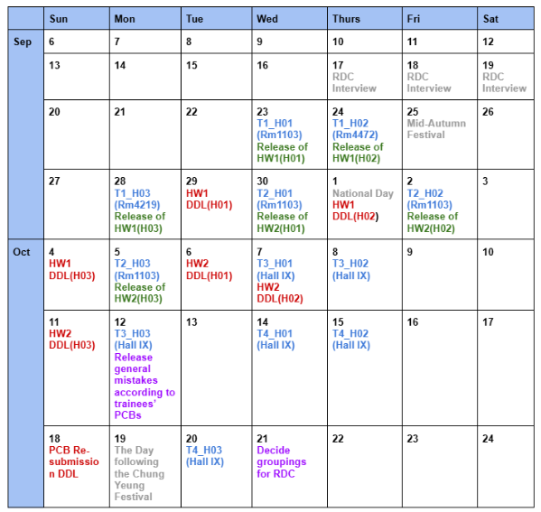

# Hardware Tutorial

Welcome to the HKUST Robotics Team Hardware Tutorial!

This repo contains everything you need, schedules, tutorials, materials, and resources. You may clone this repository or just download what you need.

## Quick Links
| Resource | Description |
|----------|-------------|
| [Tutorial Schedule](#tutorial-schedule) | Full schedule with dates & venues |
| [Homework Deadlines](#homework-releases-and-deadlines) | Due dates |
| [KiCAD Installation](#installation-of-kicad-1006) | Install guide + PDF/MD |
| [KiCAD Libraries](#kicad-libraries) | Custom RDC component library |
| [Tutorial Modules](#tutorial-modules) | Topics per tutorial |

## Tutorial Schedule

### Homework Releases and Deadlines

| Homework | Release date | Deadline |
|---|---|---|
| HW1(H01) | 23 Sep | 29 Sep |
| HW1(H02) | 24 Sep | 1 Oct |
| HW1(H03) | 28 Sep | 4 Oct |
| HW2(H01) | 30 Sep | 6 Oct |
| HW2(H02) | 2 Oct | 7 Oct |
| HW2(H03) | 5 Oct | 11 Oct |

## Installation of KiCAD 10.0.6
Please install this before the first tutorial!  

Installation link for different operating systems: 
- [Windows](https://downloads.kicad.org/kicad/windows/explore/stable)
- [MacOS](https://downloads.kicad.org/kicad/macos/explore/stable)
- Linux
  - Install from terminal via flatpack: Flatpack install-from https://flathub.org/repo/appstream/org.kicad.KiCad.flatpakref

Here are some guides on installing and setting up KiCAD:  
- [PDF guide](KiCAD-Materials/KiCAD-installation-setup.pdf) for KiCAD Installation   
- [Markdown Guide](KiCAD-Materials/Installation-Setup-Plugins.md) for KiCAD Installation & Setup
--- 
### KiCAD Libraries
We will be using a customized components library for RDC to ease the designing process for many. Below is where the library can be downloaded and steps on how to import the library:  

[RDC2026-Libraries](KiCAD-Materials/2026RDC-Libraries.zip)  

[Importing libraries into KiCAD](KiCAD-Materials/Installation-Setup-Plugins.md#importing-symbol-libraries)  

If you have any questions/facing issues, feel free to reach out the the seniors on Discord!  

--- 
### Tutorial Modules
You may view the official syllabus [here](Full-Tutorial-Syllabus.pdf).
| Module | Topic | Materials |
|--------|-------|-----------|
| Tutorial 1 | Introduction to Hardware, Components and Schematic Design with KiCAD | [Week 1 Notes](Tutorial-Notes/Week-1/HKUST-RoboticsTeam-HardwareTutorial1-Notes.pdf) |
| Tutorial 2 | Introduction to PCB Design with KiCAD | — |
| Tutorial 3 | Hands-on PCB Soldering | — |
| Tutorial 4 | Hands-on Wire Soldering and Crimping | — |

[↑ Back to Top](#hardware-tutorial)